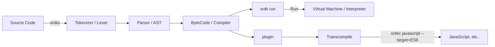

## The Sanetaka (sntk) programming language project

> **Warning**
>
> It is still under development and is not available yet.

---

We will provide the following features:

-   **Easy and simple, and even beginners can learn it quickly and easily.**
    -   it also has a C-like syntax, which makes it easy for other programmers to use the C-like syntax to learn.
-   **Using bytecode, it provides a fast interpreter.**
-   **Supports functional programming.**
-   **Supports macro. it is similar to Rust's Macros, and will provide a powerful macro system.**
-   **Supports type system.**
-   **By providing an interpreter plugin, it can transcompile to other languages. (e.g. JavaScript)**

... and more.

this may not be observed. (No, most likely. D:) however, we strive to provide better features. :D

# Progress

-   [x] Tokenizer (Tokens + Lexer)
-   [ ] Parser (AST)
-   [ ] Compiler (Bytecode)
-   [ ] Interpreter (VM)
-   [ ] Plugin (Transcompiler)

-   [ ] Macro
-   [ ] Functional Programming
-   [ ] Type System

-   [ ] Standard Library
-   [ ] Package Manager
-   [ ] Documentation

> **Note**
>
> This plan is also subject to change during development.

---



---

Here's what we think of language design:

```rs
use std::convert::to_s;
use std::io::println;

let foo: number[] = [1, 2, 3, 4, 5];

type T<U> = fn(U) -> U; // type alias

let bar: T<number> = fn(x) => x * 2;
let baz: T<string> = fn(x) => x.push<string>("!");

let result: string[] = foo.map(bar -> to_s -> baz);

println(result);
```
