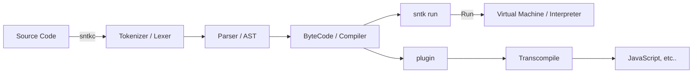

## The Sanetaka (sntk) programming language project

> **Warning**
>
> It is still under development and is not available yet.

---

We will provide the following features:

-   **Easy and simple, and even beginners can learn it quickly and easily.**
    -   it also has a C-like syntax, which makes it easy for other programmers to use the C-like syntax to learn.
-   **Using bytecode**, it provides a fast interpreter.
-   **Supports functional programming.**
-   **Supports macro**. it is similar to Rust's Macros, and will provide a powerful macro system.
-   **Supports type system.** (static type system)
-   **By providing an interpreter plugin**, it can transcompile to other languages. (e.g. JavaScript)
-   **`null` does not exist.** it is in the form of Rust's `Option<T>`, a monadic type will be decalred in the standard library.
-   **In the parsing phase, evaluable expressions are pre-evaluated.** it is providing a fast runtime.

... and more.

this may not be observed. (No, most likely.) however, we strive to provide better features.

# Progress

-   [x] Tokenizer (Tokens + Lexer)
-   [x] Parser (AST) **(in progress)**
    -   [ ] EEE (Evaluating an Evaluable Expression) **(in progress)**
-   [ ] Compiler (Bytecode)
    -   [ ] Type Checker
-   [ ] Interpreter (VM, Stack Machine)
-   [ ] Plugin (e.g. Transcompiler)
    -   [ ] Plugin API

-   [ ] Macro
-   [ ] Functional Programming
-   [ ] Type System **(in progress)**

-   [ ] Standard Library
-   [ ] Package Manager
-   [ ] Documentation

> **Note**
>
> This plan is also subject to change during development.

---



---

Here's what we think of language design:

```rs
use std::convert::to_s; /* not working yet. */
use std::io::println; /* not working yet. */

let foo: number[] = [1, 2, 3, 4, 5];

type T<U> = fn(U) -> U; /* type alias */

let bar: T<number> = fn(x: number) -> number -> x * 2;
let baz: T<string> = fn(x: string) -> string -> x.push("!");

let result: string[] = foo.map(bar -> to_s -> baz);

println(result);
```

---

**macro:** (not working yet.)

```rs
@macro foo($name:ident $args:@repeat($arg:ident, $data_type:type); $ret_type:type; $body:expr) {
    fn $name($args { $arg: $data_type }) -> $ret_type -> $body;
}

@foo(bar a: number, b: number; number; a + b);
```

---

```rs
type Ret<T, U> = fn(T, U) -> object T: U; /* type alias */
let x: fn<T, U>(T, U) -> Ret<T, U> = fn<T, U>(x: T, y: U) -> fn() -> object T: U[] {
    println("Hello, World!");
    return fn() -> object T: U[] -> object { "foo": x * y }; /* inline function */
};
let y: object number: number[] = x(10, 20)();
```

Parsing the above code will return following AST:

<details>
    <summary>AST</summary>
    <div markdown="1">

```
Program {
    statements: [
        TypeStatement(
            TypeStatement {
                name: Identifier {
                    value: "Ret",
                    position: Position(
                        2,
                        41,
                    ),
                },
                generics: [
                    Identifier {
                        value: "T",
                        position: Position(
                            2,
                            11,
                        ),
                    },
                    Identifier {
                        value: "U",
                        position: Position(
                            2,
                            14,
                        ),
                    },
                ],
                data_type: Fn(
                    FunctionType(
                        None,
                        [
                            Custom(
                                "T",
                            ),
                            Custom(
                                "U",
                            ),
                        ],
                        Object(
                            ObjectType(
                                Custom(
                                    "T",
                                ),
                                Custom(
                                    "U",
                                ),
                            ),
                        ),
                    ),
                ),
                position: Position(
                    2,
                    41,
                ),
            },
        ),
        LetStatement(
            LetStatement {
                name: Identifier {
                    value: "x",
                    position: Position(
                        3,
                        6,
                    ),
                },
                value: FunctionLiteral(
                    FunctionLiteral {
                        generics: Some(
                            [
                                Identifier {
                                    value: "T",
                                    position: Position(
                                        3,
                                        42,
                                    ),
                                },
                                Identifier {
                                    value: "U",
                                    position: Position(
                                        3,
                                        45,
                                    ),
                                },
                            ],
                        ),
                        parameters: [
                            (
                                Identifier {
                                    value: "x",
                                    position: Position(
                                        3,
                                        51,
                                    ),
                                },
                                Custom(
                                    "T",
                                ),
                            ),
                            (
                                Identifier {
                                    value: "y",
                                    position: Position(
                                        3,
                                        57,
                                    ),
                                },
                                Custom(
                                    "U",
                                ),
                            ),
                        ],
                        return_type: Fn(
                            FunctionType(
                                None,
                                [],
                                Object(
                                    ObjectType(
                                        Custom(
                                            "T",
                                        ),
                                        Array(
                                            Custom(
                                                "U",
                                            ),
                                        ),
                                    ),
                                ),
                            ),
                        ),
                        body: BlockExpression {
                            statements: [
                                ReturnStatement(
                                    ReturnStatement {
                                        return_value: FunctionLiteral(
                                            FunctionLiteral {
                                                generics: None,
                                                parameters: [],
                                                return_type: Object(
                                                    ObjectType(
                                                        Custom(
                                                            "T",
                                                        ),
                                                        Array(
                                                            Custom(
                                                                "U",
                                                            ),
                                                        ),
                                                    ),
                                                ),
                                                body: BlockExpression {
                                                    statements: [
                                                        ReturnStatement(
                                                            ReturnStatement {
                                                                return_value: ObjectLiteral(
                                                                    ObjectLiteral {
                                                                        pairs: [
                                                                            (
                                                                                StringLiteral(
                                                                                    StringLiteral {
                                                                                        value: "foo",
                                                                                        position: Position(
                                                                                            5,
                                                                                            29,
                                                                                        ),
                                                                                    },
                                                                                ),
                                                                                InfixExpression(
                                                                                    InfixExpression {
                                                                                        left: Identifier(
                                                                                            Identifier {
                                                                                                value: "x",
                                                                                                position: Position(
                                                                                                    5,
                                                                                                    33,
                                                                                                ),
                                                                                            },
                                                                                        ),
                                                                                        operator: Asterisk,
                                                                                        right: Identifier(
                                                                                            Identifier {
                                                                                                value: "y",
                                                                                                position: Position(
                                                                                                    5,
                                                                                                    37,
                                                                                                ),
                                                                                            },
                                                                                        ),
                                                                                        position: Position(
                                                                                            5,
                                                                                            37,
                                                                                        ),
                                                                                    },
                                                                                ),
                                                                            ),
                                                                        ],
                                                                        position: Position(
                                                                            5,
                                                                            38,
                                                                        ),
                                                                    },
                                                                ),
                                                                position: Position(
                                                                    5,
                                                                    39,
                                                                ),
                                                            },
                                                        ),
                                                    ],
                                                    position: Position(
                                                        6,
                                                        5,
                                                    ),
                                                },
                                                position: Position(
                                                    6,
                                                    5,
                                                ),
                                            },
                                        ),
                                        position: Position(
                                            6,
                                            6,
                                        ),
                                    },
                                ),
                            ],
                            position: Position(
                                7,
                                1,
                            ),
                        },
                        position: Position(
                            7,
                            1,
                        ),
                    },
                ),
                data_type: Fn(
                    FunctionType(
                        Some(
                            [
                                Identifier {
                                    value: "T",
                                    position: Position(
                                        3,
                                        12,
                                    ),
                                },
                                Identifier {
                                    value: "U",
                                    position: Position(
                                        3,
                                        15,
                                    ),
                                },
                            ],
                        ),
                        [
                            Custom(
                                "T",
                            ),
                            Custom(
                                "U",
                            ),
                        ],
                        Generic(
                            Generic(
                                Custom(
                                    "Ret",
                                ),
                                [
                                    Custom(
                                        "T",
                                    ),
                                    Custom(
                                        "U",
                                    ),
                                ],
                            ),
                        ),
                    ),
                ),
                position: Position(
                    7,
                    2,
                ),
            },
        ),
        LetStatement(
            LetStatement {
                name: Identifier {
                    value: "y",
                    position: Position(
                        8,
                        6,
                    ),
                },
                value: CallExpression(
                    CallExpression {
                        function: CallExpression(
                            CallExpression {
                                function: Identifier(
                                    Identifier {
                                        value: "x",
                                        position: Position(
                                            8,
                                            35,
                                        ),
                                    },
                                ),
                                arguments: [
                                    NumberLiteral(
                                        NumberLiteral {
                                            value: 10.0,
                                            position: Position(
                                                8,
                                                38,
                                            ),
                                        },
                                    ),
                                    NumberLiteral(
                                        NumberLiteral {
                                            value: 10.0,
                                            position: Position(
                                                8,
                                                38,
                                            ),
                                        },
                                    ),
                                    NumberLiteral(
                                        NumberLiteral {
                                            value: 20.0,
                                            position: Position(
                                                8,
                                                42,
                                            ),
                                        },
                                    ),
                                ],
                                position: Position(
                                    8,
                                    42,
                                ),
                            },
                        ),
                        arguments: [],
                        position: Position(
                            8,
                            44,
                        ),
                    },
                ),
                data_type: Object(
                    ObjectType(
                        Number,
                        Array(
                            Number,
                        ),
                    ),
                ),
                position: Position(
                    8,
                    45,
                ),
            },
        ),
    ],
    errors: [],
}
```

</details>
