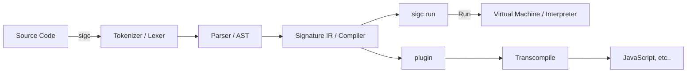
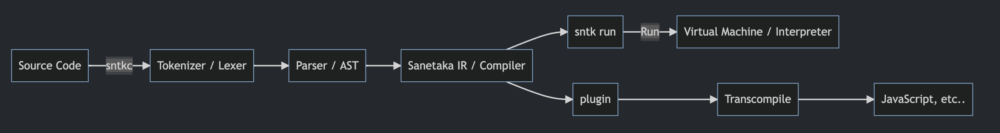

# The Signature (siglang) programming language project

[Syntax Documentation](SYNTAX.md) | [Contributing Guide](CONTRIBUTING.md)

# What features does it have?

We will provide the following features:

-   **Easy and simple, and even beginners can learn it quickly and easily.**
    -   it also has a **C-like** syntax, which makes it easy for other programmers to use the C-like syntax to learn.
-   Supports **functional programming**, **macro** (*it is similar to Rust's Macros, and will provide a powerful macro system*) and **static type system**.
-   **By providing an interpreter plugin**, it can transcompile to other languages. (e.g. JavaScript)
-   **`null` does not exist.** it is in the form of Rust's `Option<T>`, a monadic type will be decalred in the standard library.

**... and more.**

this may not be observed. (most likely.) however, we strive to provide better features.

# Progress

-   [x] Tokenizer (Tokens + Lexer)
-   [x] Parser (AST) **(in progress)**
    -   [ ] EEE (Evaluating an Evaluable Expression) **(in progress)**
-   [x] Compiler (Signature IR) **(in progress)**
    -   [ ] Type Checker **(in progress)**
-   [ ] IR Interpreter **(in progress)**
-   [ ] Plugin (e.g. Transcompiler)
    -   [ ] Plugin API

-   [ ] Macro
-   [ ] Type System **(in progress)**

-   [ ] Standard Library
-   [ ] Package Manager
-   [ ] Documentation (Click [**here**](./SYNTAX.md) to see **syntax documentation**)

> **Note**
>
> This plan is also subject to change during development.

# How does it work?

    
If <b>mermaid</b> doesn't render, click here. (image)

    

