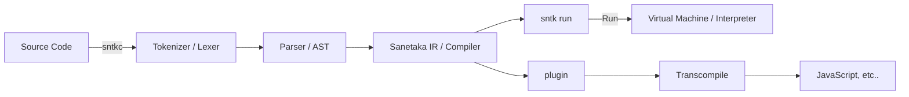

## The Sanetaka (sntk) programming language project

> **Warning**
>
> It is still under development and is not available yet.

---

We will provide the following features:

-   **Easy and simple, and even beginners can learn it quickly and easily.**
    -   it also has a C-like syntax, which makes it easy for other programmers to use the C-like syntax to learn.
-   **Using Sanetaka IR**, it provides a fast interpreter.
-   **Supports functional programming.**
-   **Supports macro**. it is similar to Rust's Macros, and will provide a powerful macro system.
-   **Supports type system.** (static type system)
-   **By providing an interpreter plugin**, it can transcompile to other languages. (e.g. JavaScript)
-   **`null` does not exist.** it is in the form of Rust's `Option<T>`, a monadic type will be decalred in the standard library.
-   **In the parsing phase, evaluable expressions are pre-evaluated.** it is providing a fast runtime.

... and more.

this may not be observed. (No, most likely.) however, we strive to provide better features.

# Progress

-   [x] Tokenizer (Tokens + Lexer)
-   [x] Parser (AST) **(in progress)**
    -   [ ] EEE (Evaluating an Evaluable Expression) **(in progress)**
-   [x] Compiler (Sanetaka IR) **(in progress)**
    -   [ ] Type Checker
-   [ ] Interpreter (VM, Stack Machine) **(in progress)**
-   [ ] Plugin (e.g. Transcompiler)
    -   [ ] Plugin API

-   [ ] Macro
-   [ ] Functional Programming
-   [ ] Type System **(in progress)**

-   [ ] Standard Library
-   [ ] Package Manager
-   [ ] Documentation

> **Note**
>
> This plan is also subject to change during development.

---

---

[Syntax Documentation](SYNTAX.md) (TODO)
